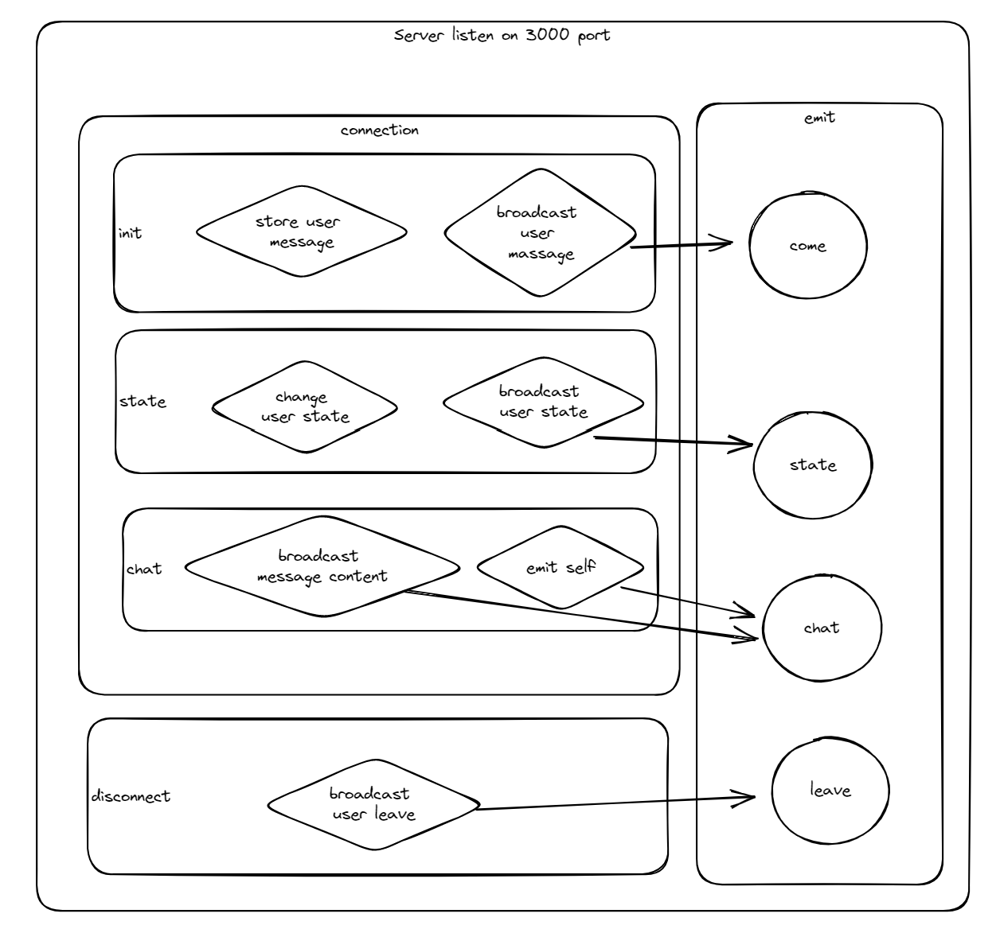
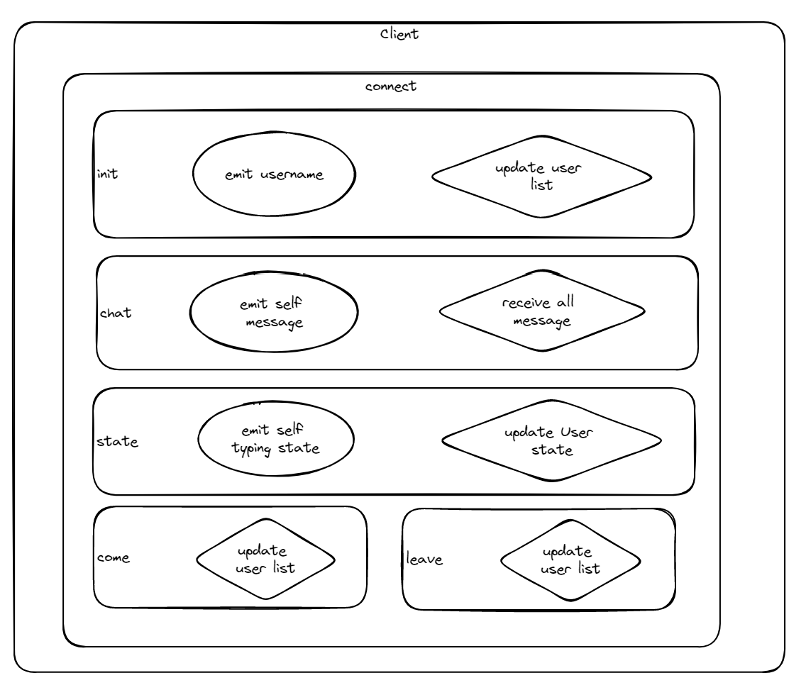
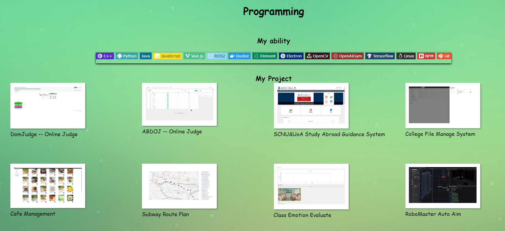

# PublicChatRoom

Programming assignment of  CS2053 – Web Application Development

[toc]

## Introduction

This Website is include infomation about myself and an interactive chat application. The chat application is a public chat room that allows users to send messages to each other. The chat application is built using Node.js, Express and Socket.IO. The chat application allows users to communicate with each other in real time.

## Dependencies

- [Node.js](https://nodejs.org/en/) - A JavaScript runtime built on Chrome's V8 JavaScript engine.
- [Express](https://expressjs.com/) - A minimal and flexible Node.js web application framework that provides a robust set of features for web and mobile applications.
- [Socket.IO](https://socket.io/) - A JavaScript library for realtime web applications. It enables realtime, bi-directional communication between web clients and servers.

## Installation

1. Install Node.js
2. Clone the repository
3. Use the command line to navigate to the directory of the repository
4. Use the command `npm install` to install the dependencies
5. Use the command `npm start` to start the server

## Package selection

### Express

Express is a minimal and flexible Node.js web application framework that provides a robust set of features for web and mobile applications. It is a fast, unopinionated, minimalist web framework for Node.js. It is designed for building web applications and APIs. I use Express to build the server of page jump and data transmission.
Compared with Koajs, Express is more mature and has more community support. It is more suitable for this project's requirements.

### Socket.IO

Socket.IO is a JavaScript library for realtime web applications. It enables realtime, bi-directional communication between web clients and servers. It has two parts: a client-side library that runs in the browser, and a server-side library for Node.js. Both components have a nearly identical API. Like Node.js, it is event-driven. Socket.IO primarily uses the WebSocket protocol with polling as a fallback option, while providing the same interface. Although it can be used as simply a wrapper for WebSocket, it provides many more features, including broadcasting to multiple sockets, storing data associated with each client, and asynchronous I/O.
In the scheme verification phase, I used [Net](https://nodejs.org/api/net.html) to build a TCP server and client. To achieve the same effect of full-duplex communication, I used the base Net package to implement some of the publish and subscribe functionality which is use closure to store the client information and send messages to all clients. However, the Net package is not as powerful as Socket.IO, and it is not easy to implement some functions. For example, the Net package does not have a broadcast function, and it is not easy to implement a broadcast function. What made me give up on the net solution was that the CDN in the nodejs official package are not suitable for browsers. When I used the [browserify](http://browserify.org/) to package the Net package, I found that the browserify package was also not suitable for browsers for some reason I don't know. Therefore, I chose Socket.IO to implement the publish and subscribe functions. Socket.IO is more suitable for this project's requirements for its useful CDN for browsers and powerful functions.

## Project structure

```text
│  .gitignore
│  LICENSE
│  package-lock.json
│  package.json
│  README.md
│  server.js
│
├─.github
│  └─workflows
│          node.js.yml
│
└─public
    ├─css
    │      style.css
    │
    ├─html
    │      about.html
    │      chat.html
    │      home.html
    │
    ├─img
    │      background.jpg
    │      logo.jpg
    │
    └─js
            chat.js
            static.js
```

## Usage

The website is consist of three pages: introduction page, about page and chat application page. The introduction page is the home page of the website. The about page is the page that introduces myself. The chat application page is the page that implements the chat application.

### Chat application

The chat application page is the page that implements the chat application. The chat application page is consist of four parts: the message display area, the message input area, the user list area and the boardcast area.
The message display area is the area that displays the messages sent by the user. If the messages is blue, it means that the message is sent by the user. If the messages is white, it means that the message is sent by other users.
The message input area is the area that allows the user to input messages. When user first enter the chat application page, the user need to enter a username in the message input area. After the user enters the username, the user can send messages to other users. The user can send messages by clicking the send button or pressing the enter key.
The user list area is the area that displays the list of users who are currently online. The user list area will display the username of the user who is currently online. When the user is typing, its username will be displayed as green. When the user is not typing, its username will be displayed as black.
The boardcast area is the area that not allow the user to input messages. The user can only receive messages from other users in the boardcast area. The boardcast area will display the event information of the user, such as the user's login and logout information.

## Implementation details

### Server

The server is implemented by using Express and Socket.IO. The server is consist of three parts: the page jump part, the static resource part and the publish and subscribe part. The page jump part is implemented by using Express. The static resource part is implemented by using Express. The publish and subscribe part is implemented by using Socket.IO.

#### Page jump

Because the website is only consist of three page, using page routing to jump is similar to using static resource loading. In addition, the introduction page and about page are static pages without flexible interaction, so I use the static resource loading method to implement the page jump.

#### Static resource

In addition to the source code of the page, the site also needs to load a portion of the image and script resources, such as the background image of the introduction page and the logo image of the chat application page. These resources are static resources, so I use the static method of express to implement the loading of static resources.

#### Publish and subscribe

The server define a class to storage the information of all users who are currently online. It stores the user id, username, create time and typing state of each user.
The server use the Socket.IO to implement the publish and subscribe function.
Following the above figure, the server will execute the following steps to listen these events when server is run:



##### Listen and Emit Client Events

- init: When the client is connected to the server, the server will create a new user object to store the information of the user. The server will also send the user list to the client.
- state: When the client is typing, the client will send the typing state to the server. The server will update the typing state of the user.
- chat: When the client sends a message, the client will send the message to the server. The server will send the message to all clients.
- disconnect: When the client is disconnected from the server, the server will delete the user object of the user. The server will also send the user list to the client.

### Client

The client is implemented by using Socket.IO. The client need to listen and emit the same events as the server. The client also need to listen and emit the following events:



### Page Style

The page style is implemented by using CSS. In this Project, I use CSS to implement the result as follows:



#### Listen and Emit Server Events

- init: When the client is connected to the server, the server will send the user list to the client. The client will update the user list.
- state: When the client is typing, the server will send the typing state of the user to the client. The client will update the typing state of the user. When user is typing, the client will send the typing state to the server. The server will update the typing state of the user.
- chat: When the client receives a message, the client will display the message. When the client sends a message, the client will send the message to the server. The server will send the message to all clients.
- come: When the client receives a user login event, the client will display the user login event.
- leave: When the client receives a user logout event, the client will display the user logout event.

## Challenges

### The difference between TCP and WebSocket

- The TCP protocol is a connection-oriented protocol.
- The WebSocket protocol is a connectionless protocol.
- The TCP protocol is a full-duplex protocol.
- The WebSocket protocol is a full-duplex protocol.
- The TCP protocol is a stream protocol.
- The WebSocket protocol is a message protocol.
- The TCP protocol is a reliable protocol.
- The WebSocket protocol is a unreliable protocol.
- The TCP protocol is a protocol that requires a handshake.
- The WebSocket protocol is a protocol that requires a handshake.

### Weakness of My Project

- The chat application is a public chat room. It does not support private chat.
- The Website is static resource loading. It does not support page routing.
- The Website loadding static resources need much time. It does not support lazy loading.

## References

- [Node.js](https://nodejs.org/en/)
- [Socket.IO Documentation](https://socket.io/docs/v4/)